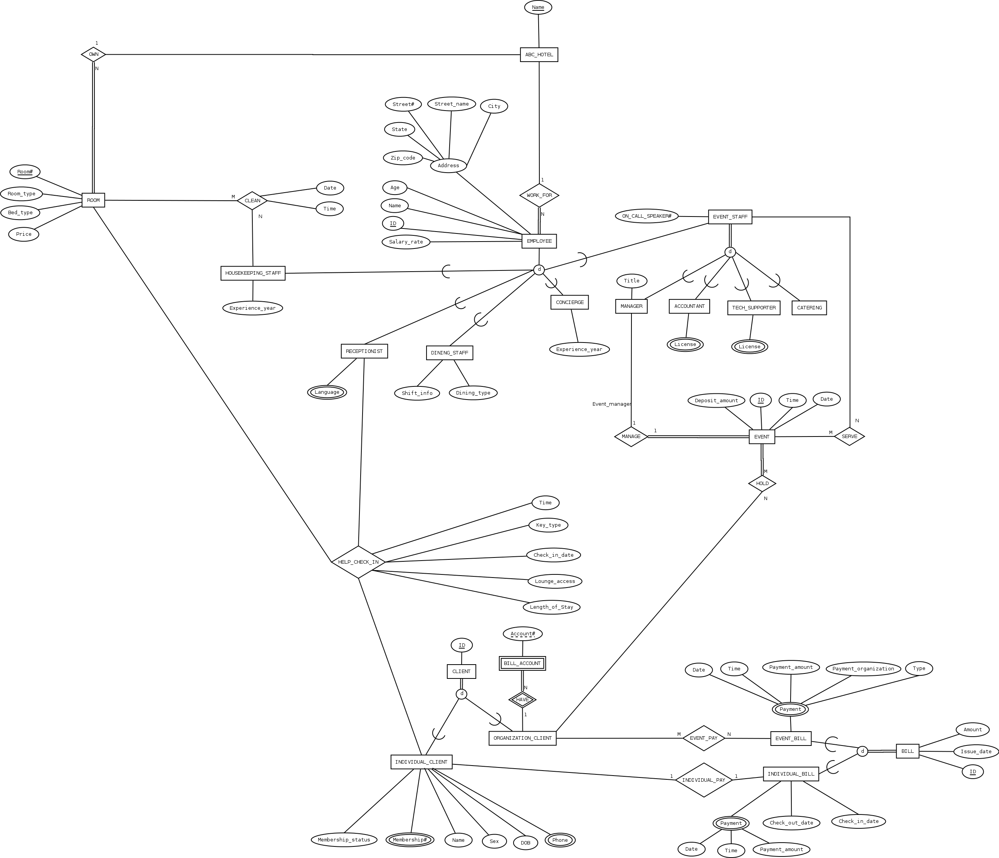

# 1. EER 

# 2.Mapping Relational Schemas
### 2.1 Mapping of Regular Entity Types, Specializations

### 2.2 Mapping of Weak Entity Types
> Weak Entity: BILL_ACCOUNT
> 
Create a relation BILL_ACCOUNT and include all simple attributes (or simple
components of composite attributes) of BILL_ACCOUNT, the primary key is the
combination of the primary key of CLIENT and partial key of BILL_ACCOUNT.

### 2.3 Mapping of Binary 1:1 Relationship Types

### 2.4 Mapping of Binary 1:N Relationship Types

### 2.5 Mapping of Binary M:N Relationship Types

### 2.6 Mapping of Multi-valued Attributes

### 2.7 Mapping of N-ary Relationship Types
